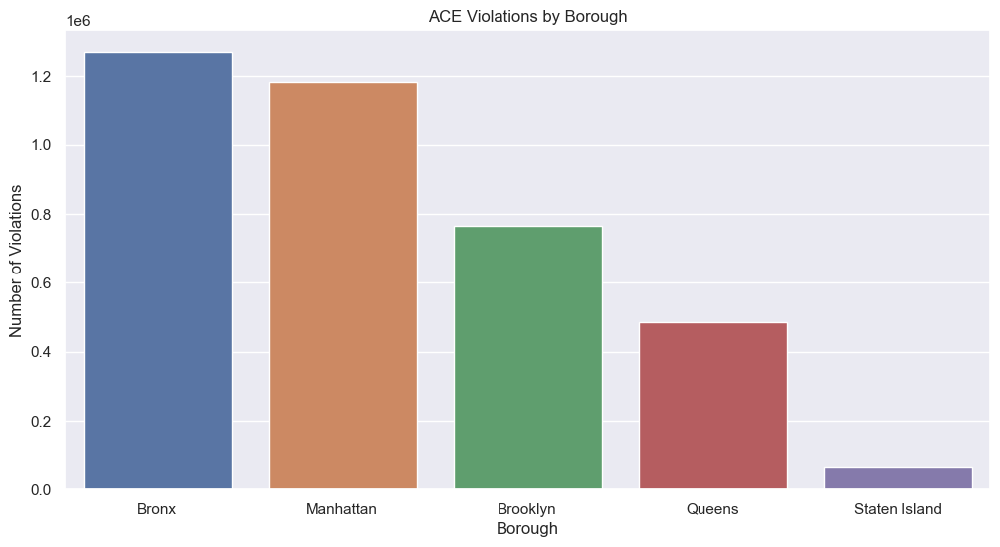
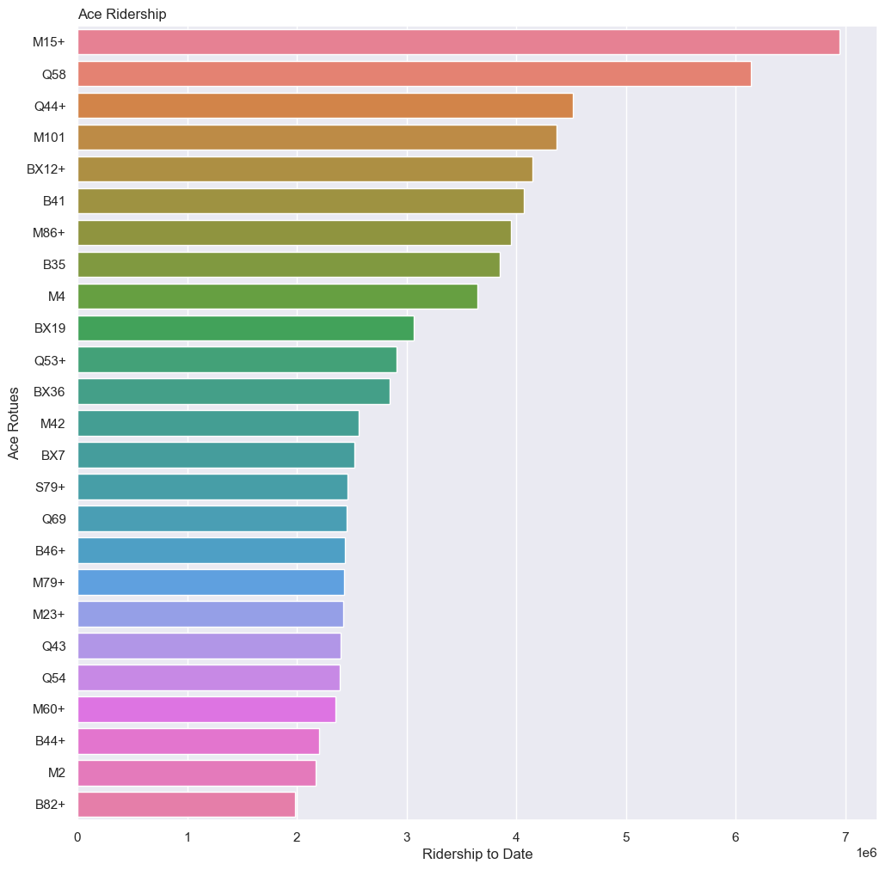
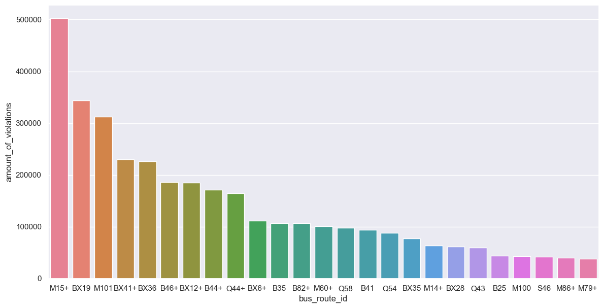
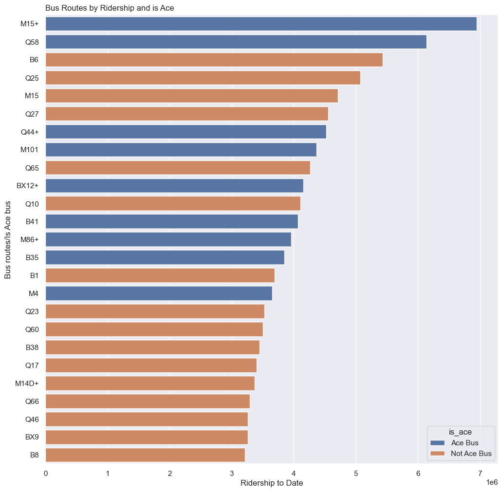
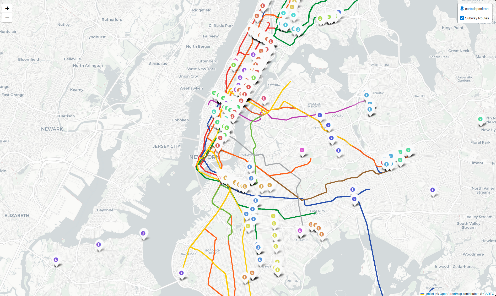
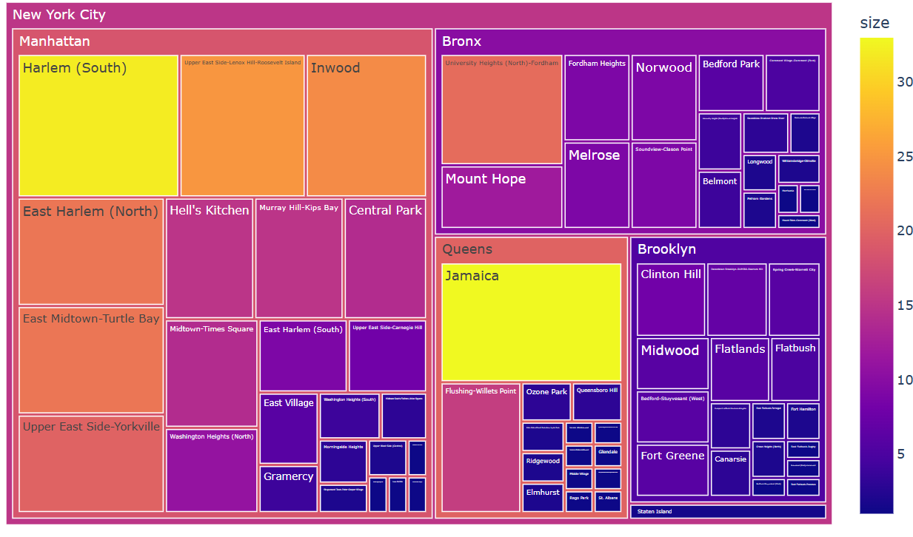

<a name="readme-top"></a>

<style>
    /* MTA-Inspired Light Theme */
    :root {
        --mta-blue: #0039A6;
        --mta-yellow: #FCCC0A;
        --mta-black: #212121;
        --mta-white: #FFFFFF;
        --mta-light-gray: #F2F2F2;
        --mta-border: #D1D1D1;
    }

    body {
        font-family: "Helvetica Neue", Helvetica, Arial, sans-serif;
        line-height: 1.6;
        color: var(--mta-black);
        background-color: var(--mta-white);
        max-width: 900px;
        margin: 0 auto;
        padding: 40px 20px;
    }

    /* Header Styling reminiscent of Subway Signage */
    h1 {
        color: var(--mta-blue);
        border-bottom: 8px solid var(--mta-yellow);
        padding-bottom: 10px;
        font-weight: 900;
        text-transform: uppercase;
        letter-spacing: -1px;
        text-align: center;
    }

    h2 {
        background-color: var(--mta-blue);
        color: var(--mta-white);
        padding: 10px 15px;
        border-radius: 4px;
        display: inline-block;
        margin-top: 40px;
    }

    h3 {
        color: var(--mta-blue);
        border-left: 5px solid var(--mta-yellow);
        padding-left: 15px;
        margin-top: 25px;
    }

    /* Table of Contents Box */
    details {
        background: var(--mta-light-gray);
        padding: 20px;
        border: 1px solid var(--mta-border);
        border-radius: 8px;
        margin: 30px 0;
    }

    summary {
        font-weight: bold;
        cursor: pointer;
        color: var(--mta-blue);
        font-size: 1.2em;
    }

    /* Content Sections */
    img {
        max-width: 100%;
        border-radius: 8px;
        box-shadow: 0 4px 12px rgba(0,0,0,0.15);
        margin: 25px 0;
        border: 1px solid var(--mta-border);
    }

    /* For inline code snippets like `pip install` */
    code {
        background-color: #F2F2F2; /* Light Gray */
        color: #0039A6;           /* MTA Blue */
        padding: 2px 5px;
        border-radius: 4px;
        font-family: "SFMono-Regular", Consolas, "Liberation Mono", Menlo, monospace;
    }

    /* For large code blocks (the ones created by ``` ) */
    pre {
        background-color: var(--mta-light-gray); /* MTA Blue background instead of black */
        color: #FFFFFF;           /* White text for readability */
        padding: 20px;
        border-radius: 8px;
        overflow-x: auto;
        /* Keeps the MTA signature yellow line on the left */
        border-left: 6px solid #FCCC0A; 
        box-shadow: inset 0 1px 3px rgba(0,0,0,0.2);
    }

    /* Optional: change the color of the text inside the pre block if you want yellow text */
    pre code {
        background-color: transparent;
        color: #FCCC0A; /* MTA Yellow text */
        padding: 0;
}

    a {
        color: var(--mta-blue);
        text-decoration: underline;
        font-weight: 500;
    }

    a:hover {
        color: var(--mta-black);
        background-color: var(--mta-yellow);
        text-decoration: none;
    }

    hr {
        border: 0;
        height: 2px;
        background: var(--mta-yellow);
        margin: 40px 0;
    }

    .contact-info {
        display: flex;
        gap: 10px;
        align-items: center;
        margin-bottom: 10px;
    }
</style>

<div align="center">
  <h1>MTA Macaulay Honors College Datathon</h1>
  <h3><i>By the Data Lions</i></h3>
</div> <br>

<details open>
<summary>Table of Contents</summary>
<ol>
    <li>
        <a href="#introduction">Introduction</a>
        <ul>
            <li><a href="#contact-information">Contact Information</a></li>
        </ul>
    </li>
    <li><a href="#analysis">Analysis</a>
        <ul>
            <li><a href="#background">Background</a></li>
            <li><a href="#ace-route-analysis">Ace Route Analysis</a></li>
            <li><a href="#ridership-analysis">Ridership Analysis</a></li>
            <li><a href="#transit-deserts">Transit Deserts</a></li>
            <li><a href="#conclusions--moving-forward">Conclusions & Moving Forward</a></li>
        </ul>
    </li>
    <li><a href="#demo">Demo</a></li>
    <li><a href="#techincal-details">Technical Details</a>
        <ul>
            <li><a href="#built-with">Built With</a></li>
            <li><a href="#data-sources">Data Sources</a></li>
            <li><a href="#usage">Usage</a></li>
        </ul>
    </li>
    <li><a href="#contributing">Contributing</a></li>
    <li><a href="#license">License</a></li>
</ol>
</details>

## Introduction

---

By comparing ridership data and violation data, our project seeks to show that beyond giving out violations as an incentive to not clog bus stops, the ACE is also a useful tool for data collection in regards to areas of improvement for the New York City public transit network.

And special thanks to [NYC Open Data][NYC Open Data-url] for providing the datasets we used in this datathon!

![NYC Open Data][NYC Open Data]

### Contact Information

Our team members and their contact information are listed below:

- David Rodriguez

  <a href="https://github.com/drod75" target="_blank"></a><a href="mailto:dr507498@gmail.com" target="_blank"></a><a href="https://www.linkedin.com/in/david-rodriguez-nyc/" target="_blank"></a>

- Chi Ling Hsieh (Anna)

  <a href="https://github.com/anna-hsh" target="_blank"></a><a href="mailto:annaclhsieh@gmail.com" target="_blank"></a>

## Analysis

---

### Background

#### ACE

The ACE program is a bus-mounted camera system that issues violations to vehicles occupying bus lanes, to double parked vehicles along bus routes, and to vehicles blocking bus stops. The goal of the system is to make bus service faster and more reliable by keeping bus lanes and bus stops clear.

### ACE Ridership and Violations





In general, it can be expected that longer routes with a higher rate of usage report a higher number of violations, as shown in the number of violations per borough, which show the Bronx, Manhattan, and Brooklyn with the highest number of violations, consistent with the three boroughs with the most ACE mounted bus routes. Individual examples include the M15+, which ranked first in both ridership and violations, and the M101 route, which ranked fourth in ridership and third in violations. However, there are notable outliers, like the B46+ (sixteenth in ridership yet sixth in ridership), the Bx36 (twelfth in ridership and fifth in violations), and the B82+ (twenty-fifth in ridership but twelfth in violations).

#### Transit Deserts



There seems to be a pattern between the paths the routes with a significant difference between ridership rankings and violation rankings take. Using our earlier examples of the B46+, Bx36, and B82, they all run in a direction and area where there are no other public transport options (most notably the Subway). From this, we may form a relation between a lack of public transport infrastructure and the number of violations detected amongst ACE bus paths.

### Conclusions & Moving Forward


The ACE system, in tandem with serving its intended purpose, provides valuable data on what places need better infrastructure for people to get around, exposing transit deserts along the routes with higher nummbers of violations. That in itself shows the merit in expanding ACE to more bus routes for a more comprehensive understanding of our public transit network. At the same time, investment should be placed into transit deserts as highlighted by ACE data, so as to curb the nnumber of violations in the future. There is room for a win-win scenario, for both residents of the area and the MTA, where ACE allows citizens use of a more convenient and stable form public transport, while the MTA can benefit from the income of an expanded network.

## Demo

---

A video to how the site works, and every feature that is stable and available so far is listed below!

[](https://www.youtube.com/embed/j0neJlknBQw)

<p align="right"><a href="#readme-top">Back to top</a></p>

## Techincal Details

---

These are the technical details for the repository, such as libraries and datasets that we used!

### Built With

[![Python][Python]][Python-url]
[![Jupyter][Jupyter]][Jupyter-url]
[![Matplotlib][Matplotlib]][Matplotlib-url]
[![Seaborn][Seaborn]][Seaborn-url]
[![Folium][Folium]][Folium-url]
[![GeoPandas][GeoPandas]][GeoPandas-url]

### Data Sources

- [MTA Bus Automated Camera Enforcement Violations](https://data.ny.gov/Transportation/MTA-Bus-Automated-Camera-Enforcement-Violations-Be/kh8p-hcbm/about_data)
- [MTA Bus Automated Camera Enforced Routes: Beginning October 2019](https://data.ny.gov/Transportation/MTA-Bus-Automated-Camera-Enforced-Routes-Beginning/ki2b-sg5y/about_data)
- [MTA Bus Hourly Ridership: Beginning 2025](https://data.ny.gov/Transportation/MTA-Bus-Hourly-Ridership-Beginning-2025/gxb3-akrn/about_data)

### Usage

To use the python notebooks and files in this repository, follow the steps below:

1. Clone the repository
   ```sh
   git clone https://github.com/drod75/MTA-MHC-Datatahon.git
   ```
2. Install the required packages

   a. If using pip, run:

   ```sh
   pip install -r requirements.txt
   ```

   b. If using UV, run:

   ```sh
   uv venv
   ```

   ```sh
   uv sync
   ```

## Contributing

---

We like open-source and want to develop practical applications for real-world problems. However, individual strength is limited. So, any kinds of contribution is welcome, such as:

- New features
- Bug fixes
- Typo fixes
- Suggestions
- Maintenance
- Documents
- etc.

#### Heres how you can contribute:

1. Fork the repository
2. Create a new feature branch
3. Commit your changes
4. Push to the branch
5. Submit a pull request

<p align="right"><a href="#readme-top">Back to top</a></p>

## License

---

See [LICENSE](https://github.com/drod75/MTA-MHC-Datatahon/blob/main/LICENSE) for more information.

[Python]: https://img.shields.io/badge/python-FFDE57?style=for-the-badge&logo=python&logoColor=4584B6
[Python-url]: https://www.python.org/
[Matplotlib]: https://img.shields.io/badge/matplotlib-FF5733?style=for-the-badge&logo=matplotlib&logoColor=white
[Matplotlib-url]: https://matplotlib.org/
[Seaborn]: https://img.shields.io/badge/seaborn-4A73B8?style=for-the-badge&logo=seaborn&logoColor=white
[Seaborn-url]: https://seaborn.pydata.org/
[Folium]: https://img.shields.io/badge/folium-4A73B8?style=for-the-badge&logo=python&logoColor=white
[Folium-url]: https://python-visualization.github.io/folium/
[GeoPandas]: https://img.shields.io/badge/GeoPandas-4A73B8?style=for-the-badge&logo=python&logoColor=white
[GeoPandas-url]: https://geopandas.org/
[Jupyter]: https://img.shields.io/badge/jupyter-F37626?style=for-the-badge&logo=jupyter&logoColor=white
[Jupyter-url]: https://jupyter.org/
[NYC Open Data]: https://img.shields.io/badge/NYC_Open_Data-008000?style=for-the-badge&logo=nyc&logoColor=white
[NYC Open Data-url]: https://opendata.cityofnewyork.us/
